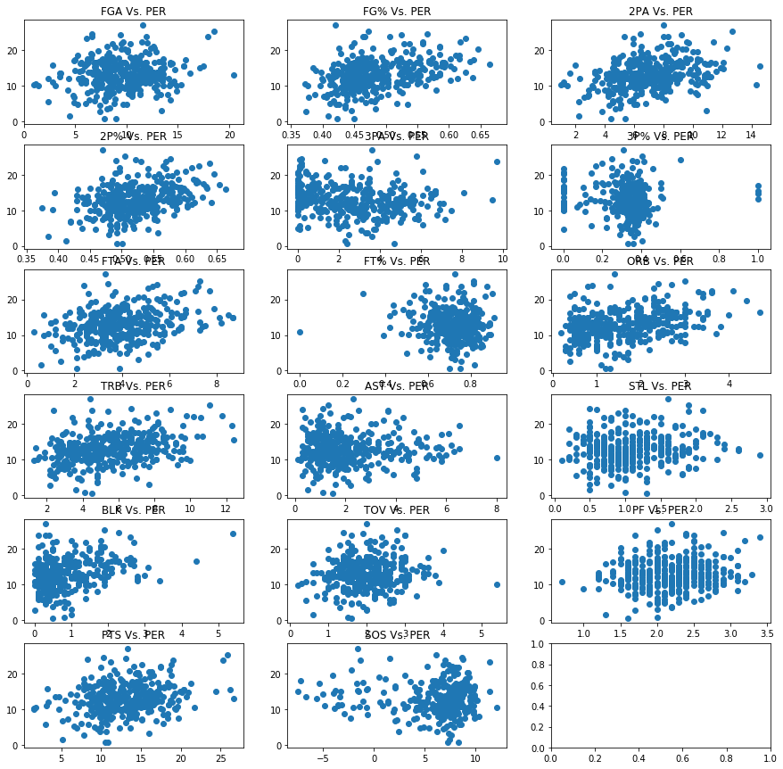

# Basketaball Stats


```python
import pandas as pd
import matplotlib.pyplot as plt #import libraries 

col_df = pd.read_csv("/Users/Matthew/Desktop/Matt's Backup/Python/College_DF") # read in college stats as dataframe
nba_df = pd.read_csv("/Users/Matthew/Desktop/Matt's Backup/Python/NBA_DF") # read in NBA stats as dataframe
col_df = col_df.rename(index = str, columns = {'Unnamed: 0':'Name'}) # fix column name 1
nba_df = nba_df.rename(index = str, columns = {'Unnamed: 0':'Name'}) # fix coulmn 1 name

print(nba_df.shape) 
print(col_df.shape) # check to see if number of players is same for both data frames
```

    (400, 28)
    (400, 26)
    

## Preview College Dataframe


```python
col_df.isnull().values.any() # check for any missing values
col_df.head(n=10) #preview data
```


<div>
<style scoped>
    .dataframe tbody tr th:only-of-type {
        vertical-align: middle;
    }

    .dataframe tbody tr th {
        vertical-align: top;
    }

    .dataframe thead th {
        text-align: right;
    }
</style>
<table border="1" class="dataframe">
  <thead>
    <tr style="text-align: right;">
      <th></th>
      <th>Name</th>
      <th>G</th>
      <th>GS</th>
      <th>MP</th>
      <th>FG</th>
      <th>FGA</th>
      <th>FG%</th>
      <th>2P</th>
      <th>2PA</th>
      <th>2P%</th>
      <th>...</th>
      <th>ORB</th>
      <th>DRB</th>
      <th>TRB</th>
      <th>AST</th>
      <th>STL</th>
      <th>BLK</th>
      <th>TOV</th>
      <th>PF</th>
      <th>PTS</th>
      <th>SOS</th>
    </tr>
  </thead>
  <tbody>
    <tr>
      <th>0</th>
      <td>Karl-Anthony Towns</td>
      <td>39.0</td>
      <td>39.0</td>
      <td>21.1</td>
      <td>3.7</td>
      <td>6.6</td>
      <td>0.566</td>
      <td>3.7</td>
      <td>6.4</td>
      <td>0.577</td>
      <td>...</td>
      <td>2.4</td>
      <td>4.3</td>
      <td>6.7</td>
      <td>1.1</td>
      <td>0.5</td>
      <td>2.3</td>
      <td>1.4</td>
      <td>2.9</td>
      <td>10.3</td>
      <td>8.67</td>
    </tr>
    <tr>
      <th>1</th>
      <td>D'Angelo Russell</td>
      <td>35.0</td>
      <td>34.0</td>
      <td>33.9</td>
      <td>6.6</td>
      <td>14.7</td>
      <td>0.449</td>
      <td>3.9</td>
      <td>8.1</td>
      <td>0.479</td>
      <td>...</td>
      <td>1.0</td>
      <td>4.7</td>
      <td>5.7</td>
      <td>5.0</td>
      <td>1.6</td>
      <td>0.3</td>
      <td>2.9</td>
      <td>2.1</td>
      <td>19.3</td>
      <td>7.37</td>
    </tr>
    <tr>
      <th>2</th>
      <td>Jahlil Okafor</td>
      <td>38.0</td>
      <td>38.0</td>
      <td>30.1</td>
      <td>7.3</td>
      <td>11.1</td>
      <td>0.664</td>
      <td>7.3</td>
      <td>11.1</td>
      <td>0.664</td>
      <td>...</td>
      <td>3.5</td>
      <td>4.9</td>
      <td>8.5</td>
      <td>1.3</td>
      <td>0.8</td>
      <td>1.4</td>
      <td>2.5</td>
      <td>2.1</td>
      <td>17.3</td>
      <td>9.87</td>
    </tr>
    <tr>
      <th>3</th>
      <td>Willie Cauley-Stein</td>
      <td>105.0</td>
      <td>70.0</td>
      <td>24.5</td>
      <td>3.3</td>
      <td>5.6</td>
      <td>0.593</td>
      <td>3.3</td>
      <td>5.6</td>
      <td>0.593</td>
      <td>...</td>
      <td>2.4</td>
      <td>3.9</td>
      <td>6.2</td>
      <td>0.9</td>
      <td>1.1</td>
      <td>2.2</td>
      <td>1.2</td>
      <td>2.3</td>
      <td>8.0</td>
      <td>8.12</td>
    </tr>
    <tr>
      <th>4</th>
      <td>Stanley Johnson</td>
      <td>38.0</td>
      <td>37.0</td>
      <td>28.4</td>
      <td>4.6</td>
      <td>10.3</td>
      <td>0.446</td>
      <td>3.4</td>
      <td>7.2</td>
      <td>0.478</td>
      <td>...</td>
      <td>2.0</td>
      <td>4.5</td>
      <td>6.5</td>
      <td>1.7</td>
      <td>1.5</td>
      <td>0.4</td>
      <td>2.2</td>
      <td>2.6</td>
      <td>13.8</td>
      <td>7.41</td>
    </tr>
    <tr>
      <th>5</th>
      <td>Frank Kaminsky</td>
      <td>144.0</td>
      <td>79.0</td>
      <td>20.4</td>
      <td>3.7</td>
      <td>7.0</td>
      <td>0.522</td>
      <td>3.0</td>
      <td>5.1</td>
      <td>0.580</td>
      <td>...</td>
      <td>1.3</td>
      <td>3.4</td>
      <td>4.6</td>
      <td>1.3</td>
      <td>0.5</td>
      <td>1.1</td>
      <td>0.8</td>
      <td>1.6</td>
      <td>10.1</td>
      <td>9.61</td>
    </tr>
    <tr>
      <th>6</th>
      <td>Justise Winslow</td>
      <td>39.0</td>
      <td>39.0</td>
      <td>29.1</td>
      <td>4.4</td>
      <td>9.1</td>
      <td>0.486</td>
      <td>3.3</td>
      <td>6.3</td>
      <td>0.516</td>
      <td>...</td>
      <td>1.3</td>
      <td>5.2</td>
      <td>6.5</td>
      <td>2.1</td>
      <td>1.3</td>
      <td>0.9</td>
      <td>1.8</td>
      <td>2.8</td>
      <td>12.6</td>
      <td>9.87</td>
    </tr>
    <tr>
      <th>7</th>
      <td>Myles Turner</td>
      <td>34.0</td>
      <td>7.0</td>
      <td>22.2</td>
      <td>3.4</td>
      <td>7.6</td>
      <td>0.455</td>
      <td>2.9</td>
      <td>5.7</td>
      <td>0.513</td>
      <td>...</td>
      <td>1.3</td>
      <td>5.2</td>
      <td>6.5</td>
      <td>0.6</td>
      <td>0.3</td>
      <td>2.6</td>
      <td>1.4</td>
      <td>2.4</td>
      <td>10.1</td>
      <td>9.07</td>
    </tr>
    <tr>
      <th>8</th>
      <td>Trey Lyles</td>
      <td>36.0</td>
      <td>21.0</td>
      <td>23.0</td>
      <td>3.3</td>
      <td>6.7</td>
      <td>0.488</td>
      <td>3.1</td>
      <td>5.9</td>
      <td>0.536</td>
      <td>...</td>
      <td>1.8</td>
      <td>3.4</td>
      <td>5.2</td>
      <td>1.1</td>
      <td>0.5</td>
      <td>0.4</td>
      <td>1.1</td>
      <td>1.6</td>
      <td>8.7</td>
      <td>8.67</td>
    </tr>
    <tr>
      <th>9</th>
      <td>Devin Booker</td>
      <td>128.0</td>
      <td>94.0</td>
      <td>24.1</td>
      <td>3.5</td>
      <td>7.0</td>
      <td>0.496</td>
      <td>3.3</td>
      <td>6.4</td>
      <td>0.518</td>
      <td>...</td>
      <td>2.1</td>
      <td>3.6</td>
      <td>5.7</td>
      <td>0.8</td>
      <td>0.6</td>
      <td>0.6</td>
      <td>1.6</td>
      <td>2.3</td>
      <td>9.0</td>
      <td>5.58</td>
    </tr>
  </tbody>
</table>
<p>10 rows × 26 columns</p>
</div>


## Preview NBA Data Frame


```python
nba_df.isnull().values.any(axis = 0) # check for any missing values
nba_nans = nba_df.isnull().any(axis = 1) # get pd.series of rows with errors index's  
err_idxs = []
for idx, value in nba_nans.items():
    if value == True:
        err_idxs.append(idx)

nans_name = col_df.loc[err_idxs].Name
nans_name2 = nba_df.loc[err_idxs].Name

print(nans_name.equals(nans_name2)) # check to see if the names for both data frames are the same
nba_df.head(n=10) # preview NBA dataframe
```

    True
    


<div>
<style scoped>
    .dataframe tbody tr th:only-of-type {
        vertical-align: middle;
    }

    .dataframe tbody tr th {
        vertical-align: top;
    }

    .dataframe thead th {
        text-align: right;
    }
</style>
<table border="1" class="dataframe">
  <thead>
    <tr style="text-align: right;">
      <th></th>
      <th>Name</th>
      <th>G</th>
      <th>GS</th>
      <th>MP</th>
      <th>FG</th>
      <th>FGA</th>
      <th>FG%</th>
      <th>3P</th>
      <th>3PA</th>
      <th>3P%</th>
      <th>...</th>
      <th>DRB</th>
      <th>TRB</th>
      <th>AST</th>
      <th>STL</th>
      <th>BLK</th>
      <th>TOV</th>
      <th>PF</th>
      <th>PTS</th>
      <th>WS</th>
      <th>PER</th>
    </tr>
  </thead>
  <tbody>
    <tr>
      <th>0</th>
      <td>Karl-Anthony Towns</td>
      <td>246.0</td>
      <td>246.0</td>
      <td>34.9</td>
      <td>8.4</td>
      <td>15.5</td>
      <td>0.543</td>
      <td>1.0</td>
      <td>2.6</td>
      <td>0.387</td>
      <td>...</td>
      <td>8.6</td>
      <td>11.7</td>
      <td>2.4</td>
      <td>0.7</td>
      <td>1.4</td>
      <td>2.3</td>
      <td>3.1</td>
      <td>21.6</td>
      <td>34.9</td>
      <td>24.5</td>
    </tr>
    <tr>
      <th>1</th>
      <td>D'Angelo Russell</td>
      <td>191.0</td>
      <td>143.0</td>
      <td>27.8</td>
      <td>5.3</td>
      <td>13.1</td>
      <td>0.409</td>
      <td>1.9</td>
      <td>5.4</td>
      <td>0.344</td>
      <td>...</td>
      <td>3.0</td>
      <td>3.6</td>
      <td>4.3</td>
      <td>1.1</td>
      <td>0.2</td>
      <td>2.7</td>
      <td>1.9</td>
      <td>14.6</td>
      <td>1.7</td>
      <td>14.4</td>
    </tr>
    <tr>
      <th>2</th>
      <td>Jahlil Okafor</td>
      <td>131.0</td>
      <td>81.0</td>
      <td>23.5</td>
      <td>5.5</td>
      <td>10.6</td>
      <td>0.515</td>
      <td>0.0</td>
      <td>0.1</td>
      <td>0.200</td>
      <td>...</td>
      <td>3.6</td>
      <td>5.3</td>
      <td>1.0</td>
      <td>0.3</td>
      <td>1.0</td>
      <td>1.8</td>
      <td>2.4</td>
      <td>12.9</td>
      <td>3.0</td>
      <td>16.0</td>
    </tr>
    <tr>
      <th>3</th>
      <td>Willie Cauley-Stein</td>
      <td>214.0</td>
      <td>118.0</td>
      <td>22.8</td>
      <td>3.9</td>
      <td>7.4</td>
      <td>0.524</td>
      <td>0.0</td>
      <td>0.1</td>
      <td>0.188</td>
      <td>...</td>
      <td>4.0</td>
      <td>5.6</td>
      <td>1.4</td>
      <td>0.8</td>
      <td>0.8</td>
      <td>1.0</td>
      <td>2.2</td>
      <td>9.4</td>
      <td>10.7</td>
      <td>16.5</td>
    </tr>
    <tr>
      <th>4</th>
      <td>Stanley Johnson</td>
      <td>219.0</td>
      <td>57.0</td>
      <td>22.6</td>
      <td>2.6</td>
      <td>7.0</td>
      <td>0.370</td>
      <td>0.8</td>
      <td>2.7</td>
      <td>0.295</td>
      <td>...</td>
      <td>2.8</td>
      <td>3.4</td>
      <td>1.5</td>
      <td>0.9</td>
      <td>0.2</td>
      <td>1.2</td>
      <td>2.1</td>
      <td>7.0</td>
      <td>2.8</td>
      <td>8.4</td>
    </tr>
    <tr>
      <th>5</th>
      <td>Frank Kaminsky</td>
      <td>235.0</td>
      <td>23.0</td>
      <td>23.4</td>
      <td>3.6</td>
      <td>8.7</td>
      <td>0.412</td>
      <td>1.2</td>
      <td>3.5</td>
      <td>0.347</td>
      <td>...</td>
      <td>3.3</td>
      <td>4.1</td>
      <td>1.7</td>
      <td>0.5</td>
      <td>0.4</td>
      <td>0.9</td>
      <td>1.5</td>
      <td>10.0</td>
      <td>9.2</td>
      <td>13.3</td>
    </tr>
    <tr>
      <th>6</th>
      <td>Justise Winslow</td>
      <td>164.0</td>
      <td>48.0</td>
      <td>27.7</td>
      <td>2.9</td>
      <td>7.2</td>
      <td>0.410</td>
      <td>0.5</td>
      <td>1.7</td>
      <td>0.314</td>
      <td>...</td>
      <td>4.3</td>
      <td>5.3</td>
      <td>2.0</td>
      <td>0.9</td>
      <td>0.4</td>
      <td>1.3</td>
      <td>2.3</td>
      <td>7.5</td>
      <td>5.0</td>
      <td>9.5</td>
    </tr>
    <tr>
      <th>7</th>
      <td>Myles Turner</td>
      <td>206.0</td>
      <td>173.0</td>
      <td>27.9</td>
      <td>4.9</td>
      <td>9.9</td>
      <td>0.498</td>
      <td>0.5</td>
      <td>1.4</td>
      <td>0.346</td>
      <td>...</td>
      <td>5.0</td>
      <td>6.5</td>
      <td>1.1</td>
      <td>0.7</td>
      <td>1.8</td>
      <td>1.3</td>
      <td>2.9</td>
      <td>12.7</td>
      <td>15.8</td>
      <td>17.2</td>
    </tr>
    <tr>
      <th>8</th>
      <td>Trey Lyles</td>
      <td>224.0</td>
      <td>39.0</td>
      <td>17.5</td>
      <td>2.8</td>
      <td>6.4</td>
      <td>0.435</td>
      <td>0.9</td>
      <td>2.5</td>
      <td>0.358</td>
      <td>...</td>
      <td>3.2</td>
      <td>3.9</td>
      <td>1.0</td>
      <td>0.4</td>
      <td>0.3</td>
      <td>0.8</td>
      <td>1.4</td>
      <td>7.4</td>
      <td>6.9</td>
      <td>13.3</td>
    </tr>
    <tr>
      <th>9</th>
      <td>Devin Booker</td>
      <td>208.0</td>
      <td>183.0</td>
      <td>32.2</td>
      <td>6.9</td>
      <td>16.1</td>
      <td>0.426</td>
      <td>1.9</td>
      <td>5.2</td>
      <td>0.365</td>
      <td>...</td>
      <td>2.8</td>
      <td>3.3</td>
      <td>3.5</td>
      <td>0.8</td>
      <td>0.3</td>
      <td>2.9</td>
      <td>3.1</td>
      <td>19.8</td>
      <td>6.3</td>
      <td>14.7</td>
    </tr>
  </tbody>
</table>
<p>10 rows × 28 columns</p>
</div>


There are missing values in the NBA players dataframe. For now I have decided to just remove these players from both data frames, so I can do some further data exploration and analysis. In the next cell I will remove said rows and seperate NBA player's PER to a seperate column, which I will initially use as my dependent variable. I will be considering all of the college stats as independent variables initially.

### Drop rows and create dependent variable


```python
nba_df = nba_df.drop(err_idxs)
col_df = col_df.drop(err_idxs)
dep_var = nba_df['PER']
```

## Data exploration 


```python
import numpy as np    #for calculations

print('Sample Size', len(nba_df['Name']))
print('PER Mean', np.mean(dep_var))
print('PER Max', np.max(dep_var))
print('PER Min', np.min(dep_var))
print('PER Median', np.median(dep_var))
print('PER Std. Deviation', np.std(dep_var))
```

    Sample Size 366
    PER Mean 12.856830601092879
    PER Max 27.1
    PER Min -18.4
    PER Median 12.8
    PER Std. Deviation 4.591783444459484
    


```python
from matplotlib.pyplot import figure

figure(figsize = (8,6))
PER_dist = plt.hist(dep_var)
plt.xlabel('PER')
plt.ylabel('Frequency')
plt.title('PER Distribution')
plt.axvline(np.mean(dep_var), color='k', linestyle='dashed', linewidth=1) #plot mean on histogram
plt.axvline(np.min(dep_var), color='k', linestyle='dashed', linewidth=1)  #plot min on histogram
plt.axvline(np.max(dep_var), color='k', linestyle='dashed', linewidth=1)  #plot max on histogram
plt.show()
```


The data seems about normally distributed, which is ideal to work with. There seems to be a few data points that are skewing the distribution to the left. I will invistagate these points further and most likely will end up removing them, hopefully this will also reduce the variance, which will help prediction errors.


```python
nba_df.loc[nba_df['PER'] < 0] # check points below 0
```


<div>
<style scoped>
    .dataframe tbody tr th:only-of-type {
        vertical-align: middle;
    }

    .dataframe tbody tr th {
        vertical-align: top;
    }

    .dataframe thead th {
        text-align: right;
    }
</style>
<table border="1" class="dataframe">
  <thead>
    <tr style="text-align: right;">
      <th></th>
      <th>Name</th>
      <th>G</th>
      <th>GS</th>
      <th>MP</th>
      <th>FG</th>
      <th>FGA</th>
      <th>FG%</th>
      <th>3P</th>
      <th>3PA</th>
      <th>3P%</th>
      <th>...</th>
      <th>DRB</th>
      <th>TRB</th>
      <th>AST</th>
      <th>STL</th>
      <th>BLK</th>
      <th>TOV</th>
      <th>PF</th>
      <th>PTS</th>
      <th>WS</th>
      <th>PER</th>
    </tr>
  </thead>
  <tbody>
    <tr>
      <th>167</th>
      <td>Darius Johnson-Odom</td>
      <td>7.0</td>
      <td>0.0</td>
      <td>3.0</td>
      <td>0.0</td>
      <td>1.6</td>
      <td>0.000</td>
      <td>0.0</td>
      <td>0.6</td>
      <td>0.00</td>
      <td>...</td>
      <td>0.7</td>
      <td>0.9</td>
      <td>0.3</td>
      <td>0.1</td>
      <td>0.0</td>
      <td>0.3</td>
      <td>0.4</td>
      <td>0.0</td>
      <td>-0.3</td>
      <td>-18.4</td>
    </tr>
    <tr>
      <th>247</th>
      <td>Andy Rautins</td>
      <td>5.0</td>
      <td>0.0</td>
      <td>4.8</td>
      <td>0.6</td>
      <td>1.4</td>
      <td>0.429</td>
      <td>0.2</td>
      <td>0.8</td>
      <td>0.25</td>
      <td>...</td>
      <td>0.2</td>
      <td>0.2</td>
      <td>0.6</td>
      <td>0.2</td>
      <td>0.0</td>
      <td>1.4</td>
      <td>0.0</td>
      <td>1.6</td>
      <td>-0.2</td>
      <td>-1.2</td>
    </tr>
  </tbody>
</table>
<p>2 rows × 28 columns</p>
</div>


Taking these players will be beneficial to the model as they are outliers (less than 10 games played with heavily negativly skewed PER). In the next cell I will remove these players from both dataframes and our dependent variable.


```python
nba_df = nba_df.drop(['167','247'], axis = 'index')
col_df = col_df.drop(['167','247'], axis = 'index')
dep_var = dep_var.drop(['167','247'], axis = 'index')
```

## Examine relationships with independent variables (college stats) 


```python
import seaborn as sns   #data visualizations

df = col_df.join(dep_var)  #dataframe of all variables
figure(figsize = (12,12))
ax = plt.axes()
corr = df.corr()
sns.heatmap(corr, xticklabels=corr.columns.values,yticklabels=corr.columns.values, cmap = 'PiYG')
ax.set_title('Correlation Heatmap')
```


    Text(0.5,1,'Correlation Heatmap')


It looks like there is some instances of high auto correlation, so I may remove some independent variables that seem redundent. Unfortunatly, there does not seem to be a very high correlation with PER and any of the independent variables. This means I, may, need to examine non-linear relationships, multivariate relationships, or the possibility that using college basketball stats to predict players future PER is not a good experiment. My first step will be to drop columns of the df dataframe that I determine as uncessary. I will drop the shots made of every stat (2P, 3P, FT, FG) as I feel the combo of attempts and percentage success accuratly captures these statistics. I think it may also be wise to drop G, GS, MP as these are not used to calculate PER and a player who plays a lot of minutes does not mean they are efficent. Lastly, I will drop defensive rebounds as it is captured in total rebounds and offensive rebounds. All of this will make the relationships easier to identify.

## Reduce dimensionality


```python
cols_drop = ['2P', '3P', 'FT', 'FG', 'G', 'GS','MP', 'DRB']
df = df.drop(columns = cols_drop)

```


```python
df.head(n=10)  #dataframe with dropped columns
```


<div>
<style scoped>
    .dataframe tbody tr th:only-of-type {
        vertical-align: middle;
    }

    .dataframe tbody tr th {
        vertical-align: top;
    }

    .dataframe thead th {
        text-align: right;
    }
</style>
<table border="1" class="dataframe">
  <thead>
    <tr style="text-align: right;">
      <th></th>
      <th>Name</th>
      <th>FGA</th>
      <th>FG%</th>
      <th>2PA</th>
      <th>2P%</th>
      <th>3PA</th>
      <th>3P%</th>
      <th>FTA</th>
      <th>FT%</th>
      <th>ORB</th>
      <th>TRB</th>
      <th>AST</th>
      <th>STL</th>
      <th>BLK</th>
      <th>TOV</th>
      <th>PF</th>
      <th>PTS</th>
      <th>SOS</th>
      <th>PER</th>
    </tr>
  </thead>
  <tbody>
    <tr>
      <th>0</th>
      <td>Karl-Anthony Towns</td>
      <td>6.6</td>
      <td>0.566</td>
      <td>6.4</td>
      <td>0.577</td>
      <td>0.2</td>
      <td>0.250</td>
      <td>3.4</td>
      <td>0.813</td>
      <td>2.4</td>
      <td>6.7</td>
      <td>1.1</td>
      <td>0.5</td>
      <td>2.3</td>
      <td>1.4</td>
      <td>2.9</td>
      <td>10.3</td>
      <td>8.67</td>
      <td>24.5</td>
    </tr>
    <tr>
      <th>1</th>
      <td>D'Angelo Russell</td>
      <td>14.7</td>
      <td>0.449</td>
      <td>8.1</td>
      <td>0.479</td>
      <td>6.6</td>
      <td>0.411</td>
      <td>4.5</td>
      <td>0.756</td>
      <td>1.0</td>
      <td>5.7</td>
      <td>5.0</td>
      <td>1.6</td>
      <td>0.3</td>
      <td>2.9</td>
      <td>2.1</td>
      <td>19.3</td>
      <td>7.37</td>
      <td>14.4</td>
    </tr>
    <tr>
      <th>2</th>
      <td>Jahlil Okafor</td>
      <td>11.1</td>
      <td>0.664</td>
      <td>11.1</td>
      <td>0.664</td>
      <td>0.0</td>
      <td>0.000</td>
      <td>5.1</td>
      <td>0.510</td>
      <td>3.5</td>
      <td>8.5</td>
      <td>1.3</td>
      <td>0.8</td>
      <td>1.4</td>
      <td>2.5</td>
      <td>2.1</td>
      <td>17.3</td>
      <td>9.87</td>
      <td>16.0</td>
    </tr>
    <tr>
      <th>3</th>
      <td>Willie Cauley-Stein</td>
      <td>5.6</td>
      <td>0.593</td>
      <td>5.6</td>
      <td>0.593</td>
      <td>0.0</td>
      <td>0.000</td>
      <td>2.8</td>
      <td>0.508</td>
      <td>2.4</td>
      <td>6.2</td>
      <td>0.9</td>
      <td>1.1</td>
      <td>2.2</td>
      <td>1.2</td>
      <td>2.3</td>
      <td>8.0</td>
      <td>8.12</td>
      <td>16.5</td>
    </tr>
    <tr>
      <th>4</th>
      <td>Stanley Johnson</td>
      <td>10.3</td>
      <td>0.446</td>
      <td>7.2</td>
      <td>0.478</td>
      <td>3.1</td>
      <td>0.371</td>
      <td>4.7</td>
      <td>0.742</td>
      <td>2.0</td>
      <td>6.5</td>
      <td>1.7</td>
      <td>1.5</td>
      <td>0.4</td>
      <td>2.2</td>
      <td>2.6</td>
      <td>13.8</td>
      <td>7.41</td>
      <td>8.4</td>
    </tr>
    <tr>
      <th>5</th>
      <td>Frank Kaminsky</td>
      <td>7.0</td>
      <td>0.522</td>
      <td>5.1</td>
      <td>0.580</td>
      <td>1.9</td>
      <td>0.369</td>
      <td>2.7</td>
      <td>0.763</td>
      <td>1.3</td>
      <td>4.6</td>
      <td>1.3</td>
      <td>0.5</td>
      <td>1.1</td>
      <td>0.8</td>
      <td>1.6</td>
      <td>10.1</td>
      <td>9.61</td>
      <td>13.3</td>
    </tr>
    <tr>
      <th>6</th>
      <td>Justise Winslow</td>
      <td>9.1</td>
      <td>0.486</td>
      <td>6.3</td>
      <td>0.516</td>
      <td>2.8</td>
      <td>0.418</td>
      <td>4.0</td>
      <td>0.641</td>
      <td>1.3</td>
      <td>6.5</td>
      <td>2.1</td>
      <td>1.3</td>
      <td>0.9</td>
      <td>1.8</td>
      <td>2.8</td>
      <td>12.6</td>
      <td>9.87</td>
      <td>9.5</td>
    </tr>
    <tr>
      <th>7</th>
      <td>Myles Turner</td>
      <td>7.6</td>
      <td>0.455</td>
      <td>5.7</td>
      <td>0.513</td>
      <td>1.8</td>
      <td>0.274</td>
      <td>3.3</td>
      <td>0.839</td>
      <td>1.3</td>
      <td>6.5</td>
      <td>0.6</td>
      <td>0.3</td>
      <td>2.6</td>
      <td>1.4</td>
      <td>2.4</td>
      <td>10.1</td>
      <td>9.07</td>
      <td>17.2</td>
    </tr>
    <tr>
      <th>8</th>
      <td>Trey Lyles</td>
      <td>6.7</td>
      <td>0.488</td>
      <td>5.9</td>
      <td>0.536</td>
      <td>0.8</td>
      <td>0.138</td>
      <td>2.8</td>
      <td>0.735</td>
      <td>1.8</td>
      <td>5.2</td>
      <td>1.1</td>
      <td>0.5</td>
      <td>0.4</td>
      <td>1.1</td>
      <td>1.6</td>
      <td>8.7</td>
      <td>8.67</td>
      <td>13.3</td>
    </tr>
    <tr>
      <th>9</th>
      <td>Devin Booker</td>
      <td>7.0</td>
      <td>0.496</td>
      <td>6.4</td>
      <td>0.518</td>
      <td>0.6</td>
      <td>0.275</td>
      <td>2.9</td>
      <td>0.658</td>
      <td>2.1</td>
      <td>5.7</td>
      <td>0.8</td>
      <td>0.6</td>
      <td>0.6</td>
      <td>1.6</td>
      <td>2.3</td>
      <td>9.0</td>
      <td>5.58</td>
      <td>14.7</td>
    </tr>
  </tbody>
</table>
</div>


I would like to view a correlation chart with the reduced features.


```python
figure(figsize = (10,10))
ax = plt.axes()
corr = df.corr()
sns.heatmap(corr, xticklabels=corr.columns.values,yticklabels=corr.columns.values, cmap = 'PiYG')
ax.set_title('Reduced Correlation Heatmap')
```


    Text(0.5,1,'Reduced Correlation Heatmap')


Next I will plot all of the dependent variables against our dependent variable (PER) to see if there are any non-linear relationships that could come in handy when modeling.


```python
def vars_plot (x_var, y_var):  #function to create a scatter plot for each x variable
    scat_plt = plt.scatter(df[x_var], df[y_var])
    plt.xlabel(x_var)
    plt.ylabel(y_var)
    plt.title(y_var + ' Vs. ' + x_var)
    return scat_plt

fig, ax = plt.subplots(6, 3, figsize = (15,15))
x_cord = 0
y_cord = 0

for var in list(df)[1:18]:
    ax[x_cord, y_cord].scatter(df[var], df['PER'])
    ax[x_cord,y_cord].set_title(var + ' Vs. ' + 'PER')
    y_cord += 1
    if y_cord > 2:
        x_cord += 1
        y_cord = 0
    
   
    
        
```





Looking at the above graphs doese not show any obvious non linear patterns.

## Try some introductory models 

The first step is to spit the data into train and test components and define a function to measure the results. I will use a simple error function defined as sqrt((predicted - actual)^2), known as root mean squared error.


```python
from sklearn.model_selection import train_test_split  # library used for model building

def calc_rmse(predicted, actual):  #function used to calculate test error
    se = (preds_lm2 - dep_test)**2
    mse = se.values.mean()
    rmse = np.sqrt(mse)
    return rmse

x_vars = ['FGA', 'FG%', '2PA', '2P%', '3PA', '3P%', 'FTA', 'FT%', 'ORB', 'TRB', 'AST', 'STL', 'BLK', 'TOV', 'PF', 'PTS', 'SOS']
x_vars = df[x_vars]
ind_vars = x_vars  # dataframe of final independent variables
ind_train, ind_test, dep_train, dep_test = train_test_split(ind_vars, dep_var, train_size = .80) # split data into train and test sets


```

    C:\Users\Matthew\Anaconda3\lib\site-packages\sklearn\model_selection\_split.py:2026: FutureWarning: From version 0.21, test_size will always complement train_size unless both are specified.
      FutureWarning)
    

I want to start with a second degree polynomial function as a benchmark.

### Second degree polynomial model 


```python
from sklearn.preprocessing import PolynomialFeatures  #transform features for fitting second degree polynomial
from sklearn import linear_model 

pf = PolynomialFeatures(degree = 2)  # transform data to include interaction terms and second degree terms
ind_trans_train = pf.fit_transform(ind_train)
ind_trans_test = pf.fit_transform(ind_test)

lm = linear_model.LinearRegression()  # fit transformed data to simple linear model
lm = lm.fit(ind_trans_train, dep_train)
preds_lm = lm.predict(ind_trans_test)
print('R^2 Value', lm.score(ind_trans_test, dep_test))
print('RMSE', calc_rmse(preds_lm, dep_test))
```

    R^2 Value -2.811088368582978
    RMSE 5.9248489952435275
    

As expected this model performs very poorly it is too complicated and overfits the data. The RMSE is almost 6, which is massive for a stat that ranges from 0 to 26. So for other models we should be looking to beat an RMSE of 6.

### Lasso model 


```python
lasso_model = linear_model.Lasso(alpha = 1) 
mod = lasso_model.fit(ind_trans_train, dep_train) # create Lasso model
lasso_preds = mod.predict(ind_trans_test)
mod.coef_
```


    array([ 0.        , -0.        ,  0.        ,  0.        ,  0.        ,
           -0.        , -0.        , -0.        , -0.        ,  0.        ,
            0.        ,  0.        ,  0.        ,  0.        , -0.        ,
           -0.        , -0.        , -0.        , -0.02499722,  0.        ,
           -0.        ,  0.        ,  0.        , -0.        , -0.03477576,
           -0.        ,  0.        , -0.        ,  0.        ,  0.        ,
            0.        , -0.        , -0.        , -0.        , -0.        ,
            0.        ,  0.        ,  0.        , -0.        , -0.        ,
            0.        ,  0.        ,  0.        ,  0.        ,  0.        ,
            0.        ,  0.        ,  0.        ,  0.        ,  0.        ,
            0.        , -0.        ,  0.        ,  0.        , -0.        ,
           -0.        , -0.        ,  0.        ,  0.        ,  0.        ,
            0.        ,  0.        , -0.        , -0.        , -0.        ,
            0.        ,  0.        , -0.        , -0.        ,  0.        ,
            0.        ,  0.        ,  0.        ,  0.        ,  0.        ,
            0.        , -0.        ,  0.        ,  0.        ,  0.        ,
            0.        , -0.        , -0.        , -0.        , -0.        ,
           -0.03448655, -0.        ,  0.        , -0.        , -0.        ,
           -0.        ,  0.        , -0.04294042, -0.        , -0.        ,
           -0.        , -0.        , -0.        ,  0.        , -0.        ,
           -0.        , -0.        , -0.        , -0.        , -0.        ,
           -0.        , -0.        ,  0.        ,  0.        ,  0.        ,
            0.        ,  0.        , -0.        , -0.        , -0.        ,
           -0.        , -0.        ,  0.        , -0.        , -0.        ,
            0.        ,  0.        , -0.        , -0.        , -0.        ,
           -0.        ,  0.        ,  0.        ,  0.        ,  0.        ,
            0.        , -0.        ,  0.        ,  0.02830787,  0.        ,
            0.02393816,  0.        ,  0.        ,  0.        , -0.        ,
           -0.        , -0.        , -0.        , -0.        ,  0.        ,
            0.        , -0.        , -0.        ,  0.01241526,  0.        ,
            0.        ,  0.        , -0.        , -0.        ,  0.07642129,
           -0.        ,  0.        , -0.        ,  0.        ,  0.03813513,
            0.        , -0.        , -0.        , -0.        , -0.04458501,
           -0.        , -0.        , -0.10179071,  0.0184929 ,  0.03221409,
            0.00214773])


Here we can see a lot of the coefficients are zeroed out, which leads me to believe this is a more flexible model that will perform better on new data.


```python
print('RMSE =', calc_rmse(lasso_preds, dep_test))
print('R^2 = ', mod.score(ind_trans_test, dep_test))
```

    RMSE = 5.9248489952435275
    R^2 =  0.1887642307145112
    

So here we see the RMSE did not improve much but the R^2 statistic does which means are model fits the test data better than the polynomial model.
